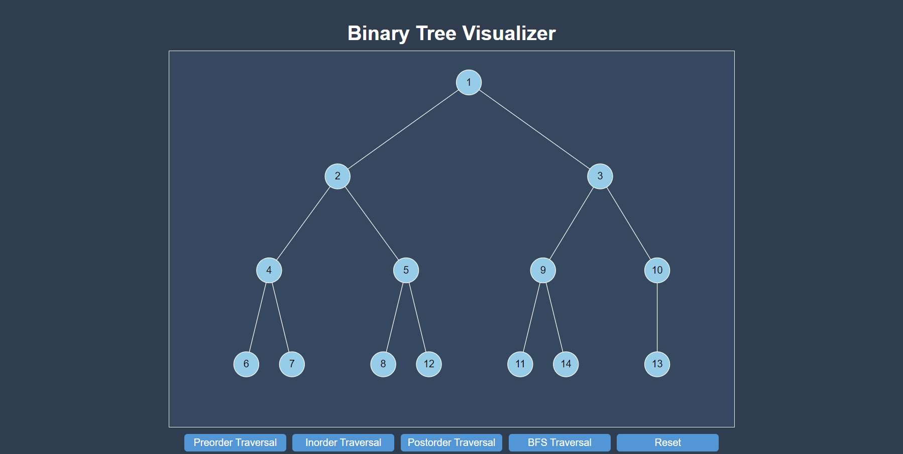

This is a Binary Tree Visualizer built using React and D3.js. It allows users to interactively create a binary tree and visualize different tree traversal algorithms of Preorder, Inorder, Postorder, and Breadth-First Search (BFS).



## To run the application

1. Clone the repository:
```bash
git clone https://github.com/yourusername/binary-tree-visualizer.git
cd binary-tree-visualizer
```

2. Install dependencies:
```bash
npm install
```

3. Start the server
```bash
npm start
```


Click on a node to create child nodes and run one of the  traversal algorithms.